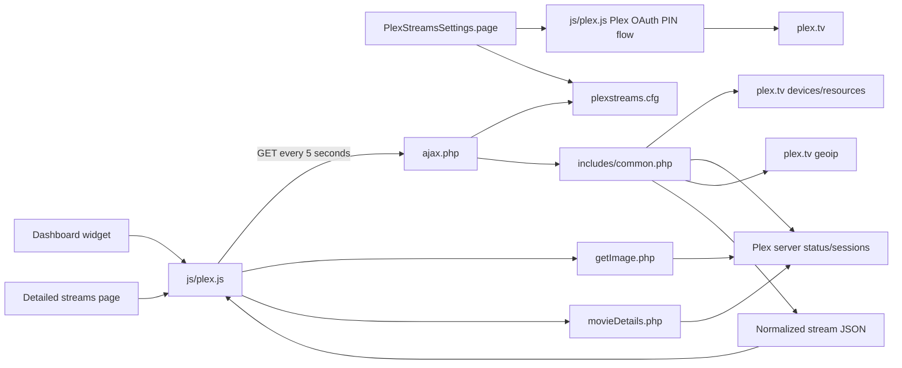
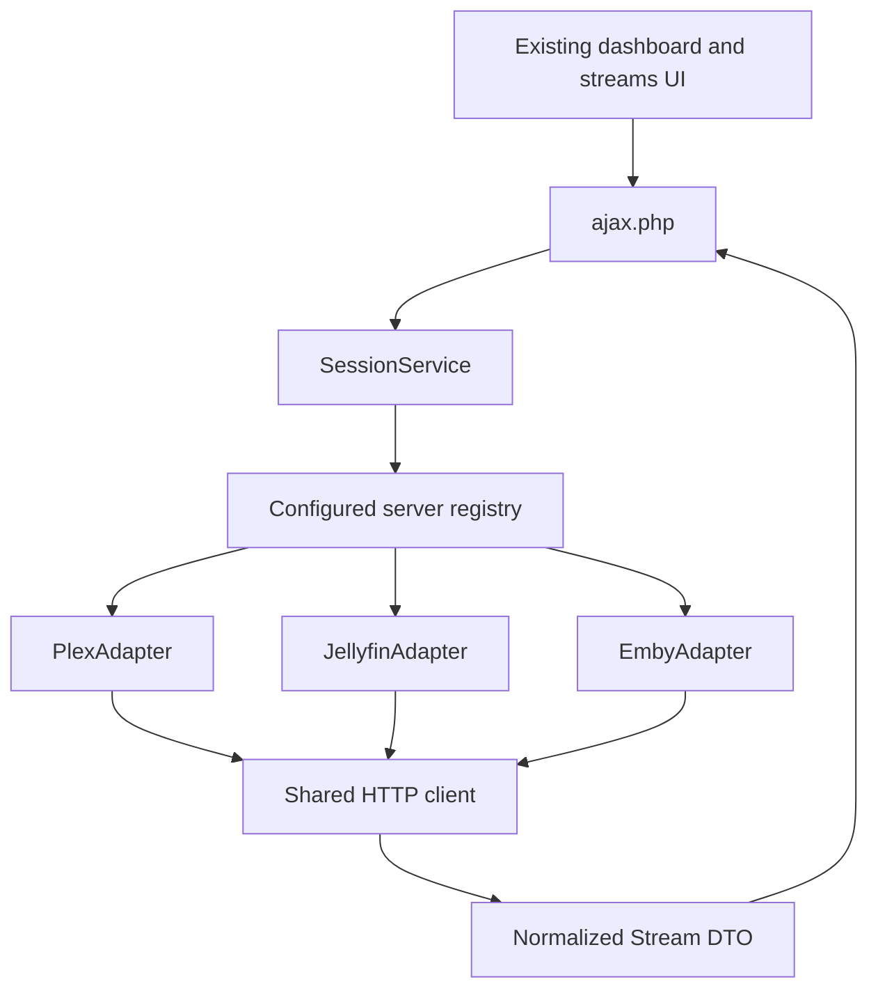

# Plex Streams Architecture and Multi-Backend Plan

## Scope

This document describes the plugin at `v2023.11.27` as shipped in this repository. It guides a cleanup that preserves the existing Unraid dashboard and stream-detail experience while allowing Plex, Jellyfin, and Emby servers to coexist.

The plugin is an Unraid WebGUI plugin written in PHP and jQuery. Its source package lives below `src/plexstreams`; `plexstreams.plg` installs the packaged contents into `/usr/local/emhttp/plugins/plexstreams` and persists configuration in `/boot/config/plugins/plexstreams/plexstreams.cfg`.

## Runtime Architecture



### Installation and page entry points

- `plexstreams.plg` is the plugin manifest, updater metadata, and launch point (`Settings/PlexStreams`).
- `src/pkg_build.sh` packages `src/plexstreams` as a Slackware `.txz`, updates the manifest version and checksum, and writes artifacts to `archive/`.
- `PlexStreamsSettings.page` is the modern settings page. `Legacy/Settings.page` is used when the relevant Unraid translations support is absent.
- `NewDashboard.page` serves Unraid versions newer than `6.12.0-beta5`. `PlexStreams_dashboard.page` and `Legacy/Dashboard.page` support older dashboard layouts.
- `Plex_Streams.page`, `PlexStreamsTools.page`, and `PlexStreamsToolsStreams.page` expose the navigation and detailed stream view. `stream_display.php` produces the initial detailed cards.

## Current Plex Data Flow

1. The user selects **Get Plex Token** in `PlexStreamsSettings.page`.
2. `js/plex.js` creates a Plex PIN with `POST https://plex.tv/api/v2/pins`, opens `app.plex.tv/auth`, and polls the PIN endpoint once per second until it receives `authToken`.
3. Unraid's `/update.php` writes `TOKEN`, selected `HOST` URLs, optional `CUSTOM_SERVERS`, display toggles, and generated `ALIAS-*` entries to the plugin INI file.
4. Settings-page discovery calls `getServers.php`. `getServers()` in `includes/common.php` requests `https://plex.tv/devices.xml` and `https://plex.tv/api/resources`, then returns server connection URLs.
5. All views poll `ajax.php` every five seconds. `getStreams()` builds two requests per configured host: `/status/sessions` and `/media/subscriptions/scheduled`, both authenticated with the Plex token.
6. `getUrl()` uses `curl_multi` to retrieve the server XML responses in parallel. `mergeStreams()` turns selected video and audio media entries into a shared array used by the dashboard and detail page.
7. The browser creates or updates DOM nodes by stream `id`, starts a local one-second position counter for playing streams, and removes nodes absent from the latest response.

The scheduled-subscription calls are fetched but their results are not rendered; the related handling in `mergeStreams()` is commented out.

## Configuration Model

The existing INI keys are Plex-specific and model one logical Plex account across multiple selected endpoints:

| Key | Purpose |
| --- | --- |
| `TOKEN` | Plex account token from the browser OAuth PIN flow. |
| `HOST` | Comma-separated discovered Plex connection URLs. |
| `CUSTOM_SERVERS` | Comma-separated manually entered Plex URLs. |
| `ALIAS-<host>` | Display name generated while listing discovered connections. |
| `DISPLAY_NAV` / `DISPLAY_WIDGET` | Navigation and dashboard visibility. |
| `FORCE_PLEX_HTTPS` | Requests HTTPS connection records during Plex discovery. |

The settings page must currently have a token before it can discover servers. `CUSTOM_SERVERS` is the only path for a server Plex does not return.

## API and Rendering Contract

`ajax.php` is the most valuable compatibility boundary. The front end assumes the following shape, even though no formal schema exists today:

```json
{
  "id": "unique-session-id",
  "type": "video|audio",
  "alias": "Server display name",
  "title": "HTML display title",
  "titleString": "plain title",
  "user": "Viewer",
  "userAvatar": "image URL",
  "state": "playing|paused|buffering",
  "stateIcon": "play|pause|buffer",
  "duration": 3600000,
  "currentPositionHours": 0,
  "currentPositionMinutes": 15,
  "currentPositionSeconds": 32,
  "lengthDisplay": "01:00:00",
  "percentPlayed": 26,
  "endTime": "08:30 PM",
  "locationDisplay": "LAN (192.0.2.10)",
  "bandwidth": 8.4,
  "streamDecision": "Direct Play",
  "streamInfo": {
    "audio": { "decision": "Direct Play" },
    "video": { "decision": "Transcode" }
  },
  "artUrl": "/plugins/plexstreams/getImage.php?...",
  "thumbUrl": "/plugins/plexstreams/getImage.php?...",
  "key": "/library/metadata/...",
  "@host": "https://server.example:32400"
}
```

The actual Plex representation stores stream decisions under `streamInfo.*['@attributes'].decision`; PHP-rendered pages accept both that form and a direct `decision` field, while the JavaScript update path currently expects the Plex form. The cleanup should make this a documented, provider-free shape: use direct fields such as `audioDecision` and `videoDecision`, and make all display strings plain text. Do not make provider response objects part of the public AJAX response.

`id` must identify a playback session, not merely a media item. It is used as a DOM ID, so two viewers watching the same item must produce distinct values.

## Findings and Cleanup Priorities

### P0: security and trust boundaries

1. TLS verification is disabled for all stream requests in `includes/common.php`, as well as the image proxy and metadata request. This exposes account tokens and data to interception. Centralize HTTP transport, verify certificates by default, and retain an explicit, per-server opt-out only for self-signed local deployments.
2. `getImage.php` accepts arbitrary `host` and `img` query values; an absolute `img` URL bypasses the configured host. It therefore behaves as an authenticated network fetcher and needs an allowlist of configured server origins, strict path validation, redirect revalidation, and a response-size cap.
3. Stream, user, server, and metadata fields are interpolated into JavaScript HTML strings and PHP `echo` output without escaping. Treat all provider data as untrusted. Render browser text through `.text()`/DOM APIs, sanitize URLs, and escape server-rendered text with `htmlspecialchars(..., ENT_QUOTES, 'UTF-8')`.
4. `?dbg` can dump response contents and URLs containing the Plex token. Remove public debug output or restrict it to a privileged, redacted diagnostics path.
5. The Plex token is written as plaintext in the persistent plugin INI file. Confirm Unraid's supported secret-storage mechanism before changing this; at minimum, ensure restrictive permissions and never include it in logs or responses.

### P1: correctness, reliability, and maintainability

1. `includes/common.php` combines HTTP transport, Plex discovery, XML parsing, normalization, formatting, geolocation, and configuration interpretation. This is the main obstacle to additional providers.
2. Several requests are made per poll without a total timeout, status-code handling, response validation, retry policy, or a concurrency bound. A stalled server can slow every page refresh.
3. `getGeo()` can make an external Plex request for each remote stream on every poll. Cache results with a TTL, make geolocation optional, and never let it block session rendering.
4. The code fetches scheduled subscriptions even though the resulting data is unused. Remove it until there is a rendered feature with tests.
5. `lengthMinuites` is misspelled where `lengthMinutes` is populated, producing incorrect/null minute values. The audio branch also uses the stale `$loc` value when constructing `locationDisplay`; calculate it from each audio session.
6. There are inconsistent failure semantics: `ajax.php` can return an empty HTTP 200 body when no token exists, while the client only treats HTTP 500 as an unconfigured state. Return structured JSON errors and use explicit HTTP status codes.
7. The browser timer is only an approximation between five-second polls. Keep it, but resynchronize from the server on each response and avoid assuming a duration exists for live streams.
8. The detailed view is rendered once in PHP and then maintained by JavaScript. It duplicates markup and behavior. Move to a single client-side renderer or a shared template after the API contract is stabilized.
9. There are three dashboard paths and legacy settings paths. Define the lowest Unraid version to support, then remove obsolete variants or make them share templates and rendering helpers.

### P2: packaging and project health

1. There are no automated tests, fixtures, dependency manifest, lint command, or CI workflow.
2. `src/pkg_build.sh` updates the manifest in place and relies on GNU/Linux tools (`readlink -f`, `sed -i`, `makepkg`, `md5sum`). Document that it runs in an Unraid/Linux build environment; it will not run unchanged on macOS.
3. `PLUGIN_VERSION` in `includes/common.php` is `2023.03.26`, while the manifest version is `2023.11.27`. Derive this from build metadata or update it in one place.

## Target Architecture

Use a provider-neutral session facade with provider adapters. Keep the current URLs during the first migration so dashboard pages do not need to change.



Suggested PHP layout:

```text
includes/
  HttpClient.php
  Stream.php
  StreamFormatter.php
  ServerRegistry.php
  SessionService.php
  adapters/
    MediaServerAdapter.php
    PlexAdapter.php
    JellyfinAdapter.php
    EmbyAdapter.php
```

The shared HTTP client owns URL parsing, origin allowlists, TLS policy, timeouts, status checks, JSON/XML decoding, and redacted errors. Adapters own only authentication headers, provider endpoint construction, provider response parsing, and mapping into a `Stream` DTO.

An adapter should expose operations close to the user experience rather than provider-specific response shapes:

```php
interface MediaServerAdapter
{
    public function provider(): string;

    /** Return sessions mapped to the provider-neutral stream DTO. */
    public function activeStreams(ServerConfig $server): array;

    /** Return an allowlisted image response for a previously emitted media ref. */
    public function image(ServerConfig $server, MediaRef $media, string $kind): ImageResponse;

    /** Optional: only Plex needs account-based server discovery initially. */
    public function discoverServers(AccountConfig $account): array;

    /** Optional capability; return null where provider metadata is unsupported. */
    public function mediaDetails(ServerConfig $server, MediaRef $media): ?MediaDetails;
}
```

`MediaRef` must be opaque to the UI. It can contain a Plex metadata key, a Jellyfin/Emby item UUID, and an associated configured server ID, but it should not allow callers to provide an arbitrary host or URL.

## Provider Notes

| Concern | Plex | Jellyfin | Emby |
| --- | --- | --- | --- |
| Authentication | Browser OAuth PIN token | Admin/user API key or access token | API key or access token |
| Discovery | Account APIs return server connections | Start with configured base URL | Start with configured base URL |
| Active sessions | `/status/sessions` XML | `/Sessions` JSON | `/Sessions` JSON |
| Artwork | Plex metadata paths | Item image endpoint by item ID | Item image endpoint by item ID |
| Transcode state | `Media`/`TranscodeSession` | `TranscodingInfo` and play state | `TranscodingInfo` and play state |

Jellyfin and Emby are similar at a high level, but do not assume their fields or authentication headers are interchangeable. Build each adapter against pinned recorded responses from the server versions you intend to support. For an initial release, ask the user to create and supply a least-privileged API key and a direct base URL; this avoids storing a username and password and removes the need for a new OAuth-like browser flow.

Jellyfin/Emby should be modeled as individually configured server instances, not a single global `SERVER_TYPE`. That permits a dashboard to aggregate Plex, Jellyfin, and Emby sessions at once.

## Configuration Migration

Keep the existing Plex INI keys readable for backward compatibility. Add a versioned structured server registry, for example a JSON value stored in the plugin configuration or a separate mode-0600 JSON file:

```json
{
  "version": 1,
  "servers": [
    {
      "id": "plex-home",
      "provider": "plex",
      "name": "Plex Home",
      "baseUrl": "https://plex.example:32400",
      "credentialRef": "plex-home-token"
    },
    {
      "id": "jellyfin-lan",
      "provider": "jellyfin",
      "name": "Jellyfin",
      "baseUrl": "https://jellyfin.example",
      "credentialRef": "jellyfin-lan-api-key"
    }
  ]
}
```

Migrate `HOST`, `CUSTOM_SERVERS`, `ALIAS-*`, and `TOKEN` into Plex registry entries on first save. Preserve the old keys until at least one release after a successful migration, and make migration idempotent with a backup. Credentials should be stored separately from non-secret configuration if Unraid provides a supported facility for that purpose.

The settings UI should become an editable server list with provider selector, name, base URL, credential input, connectivity test, and per-server TLS policy. Plex discovery remains a provider-specific convenience action; Jellyfin and Emby initially use manually supplied URLs.

## Incremental Delivery Plan

1. Add response fixtures and tests around today's Plex normalization before moving code. Include video, audio, live TV/no duration, paused, remote, two viewers of one item, malformed XML, and unavailable-server cases.
2. Define the neutral stream DTO and a JSON schema. Change the UI to consume only that DTO, with text-safe rendering and a stable session ID.
3. Extract `HttpClient`, formatting, image authorization, and the current Plex behavior into `PlexAdapter`. Keep `ajax.php` as a thin facade and verify that its response fixtures do not change unexpectedly.
4. Add the registry and settings migration, allowing multiple configured instances. Keep legacy Plex configuration working.
5. Implement Jellyfin sessions and images first. Mark metadata details and precise direct-play/transcode labels as capability-dependent rather than manufacturing Plex-like values.
6. Implement Emby with separate fixtures and capability checks. Share code only after behavior and response fields are proven compatible.
7. Consolidate dashboard/detail templates and retire legacy Unraid layouts according to an explicit support policy.

## Validation Strategy

- Unit-test normalization from recorded, token-redacted Plex, Jellyfin, and Emby session fixtures. Test missing optional fields deliberately.
- Unit-test URL/origin validation and verify that image and metadata paths cannot reach an unconfigured host or an arbitrary URL.
- Integration-test each adapter against an opt-in local test server or mocked HTTP client; never require a live personal media server in CI.
- Browser-test an empty state, multiple simultaneous sessions, live TV, paused playback, artwork failure, and a server timeout on both supported dashboard layouts until the legacy layouts are retired.
- Run PHP syntax checks over `.php` files as a minimum local gate, then build the package in an Unraid-compatible environment before release.

## Recommended First Cleanup Slice

Start with a behavior-preserving `HttpClient` extraction and fixture tests for `mergeStreams()`. In the same slice, make the response use stable session IDs, remove unused scheduled-subscription fetching, correct the minute/location defects, and return structured errors. This is small enough to validate against Plex before introducing new settings or provider behavior, but it creates the boundary that makes Jellyfin and Emby practical.