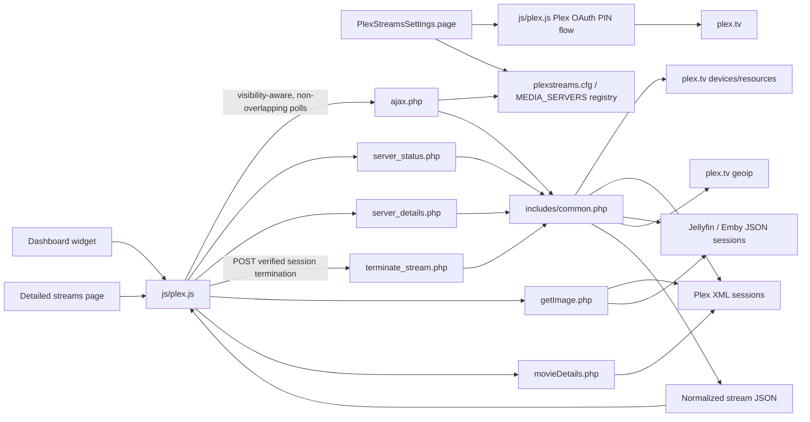
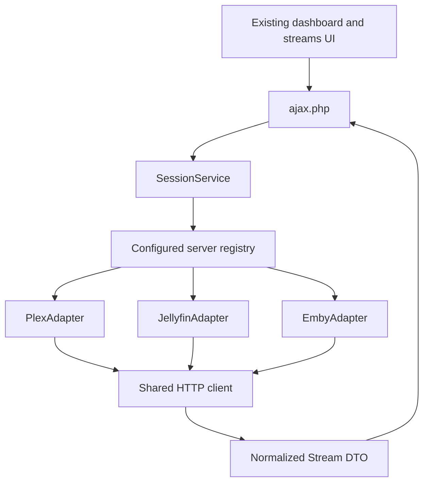

# Plex Streams Architecture and Multi-Backend Plan

## Scope

This document describes the plugin at `v2026.08.23` as shipped in this repository. It records the implemented Plex, Jellyfin, and Emby aggregation path and identifies the remaining cleanup needed to make that multi-backend support maintainable and secure.

The plugin is an Unraid WebGUI plugin written in PHP and jQuery. Its source package lives below `src/plexstreams`; `plexstreams.plg` installs the packaged contents into `/usr/local/emhttp/plugins/plexstreams` and persists configuration in `/boot/config/plugins/plexstreams/plexstreams.cfg`.

## Runtime Architecture



### Installation and page entry points

- `plexstreams.plg` is the plugin manifest, updater metadata, and launch point (`Settings/PlexStreams`).
- `src/pkg_build.sh` packages `src/plexstreams` as a Slackware `.txz`, updates the manifest version and checksum, and writes artifacts to `archive/`.
- `PlexStreamsSettings.page` is the modern settings page. `Legacy/Settings.page` is used when the relevant Unraid translations support is absent.
- `NewDashboard.page` serves Unraid versions newer than `6.12.0-beta5`. `PlexStreams_dashboard.page` and `Legacy/Dashboard.page` support older dashboard layouts.
- `Plex_Streams.page`, `PlexStreamsTools.page`, and `PlexStreamsToolsStreams.page` expose the navigation and detailed stream view. The dedicated stream page is AJAX-first: `stream_display.php` supplies the loading surface and client-side rendering maintains stream cards.
- `server_status.php` and `server_details.php` return per-server health/details. `terminate_stream.php` validates a current stream before issuing provider-specific termination.

## Current Multi-Backend Data Flow

1. The user selects **Get Plex Token** in `PlexStreamsSettings.page`.
2. `js/plex.js` creates a Plex PIN with `POST https://plex.tv/api/v2/pins`, opens `app.plex.tv/auth`, and polls the PIN endpoint once per second until it receives `authToken`.
3. Unraid's `/update.php` writes legacy Plex values plus dashboard/debug preferences and the `MEDIA_SERVERS` JSON registry. The settings UI exposes Plex, Jellyfin, and Emby server cards; Jellyfin/Emby require a direct base URL and API key.
4. Plex discovery still calls `getServers.php`, which requests the Plex device and resource APIs. The transient OAuth token can be used before settings are saved. Jellyfin and Emby are manually configured server instances.
5. Visible dashboard and stream views poll `ajax.php` on a five-second cadence. `startStreamPolling()` schedules the next request only after the preceding request completes and defers polling while the browser tab is hidden.
6. `getAllMergedStreams()` preserves legacy Plex configuration, fetches Plex `/status/sessions` XML with the `X-Plex-Token` request header, and fetches Jellyfin/Emby `/Sessions` JSON with `X-Emby-Token`. Plex XML is normalized by `mergeStreams()`; Jellyfin/Emby sessions are normalized by `mapEmbyLikeSession()` into the same response shape.
7. The browser creates, updates, animates, and removes cards by stable provider-prefixed stream ID. It resynchronizes its one-second playback counter on every poll, groups cards by server, retains expansion state in the browser, and can request termination when the provider reports remote-control capability.

## Configuration Model

The legacy Plex INI keys remain supported. `MEDIA_SERVERS` is a versioned registry for Jellyfin and Emby instances; it can be stored as JSON or base64-encoded JSON. When a registry exists, it takes precedence over the single legacy Jellyfin/Emby convenience entries.

| Key | Purpose |
| --- | --- |
| `TOKEN` | Plex account token from the browser OAuth PIN flow. |
| `HOST` | Comma-separated discovered Plex connection URLs. |
| `CUSTOM_SERVERS` | Comma-separated manually entered Plex URLs. |
| `ALIAS-<host>` | Display name generated while listing discovered connections. |
| `DISPLAY_NAV` / `DISPLAY_WIDGET` | Navigation and dashboard visibility. |
| `DASHBOARD_LAYOUT` | `default` or `condensed` dashboard-widget layout. |
| `FORCE_PLEX_HTTPS` | Requests HTTPS connection records during Plex discovery. |
| `DEBUG_LOGGING` | Enables redacted diagnostic logging with rotation. |
| `MEDIA_SERVERS` | Versioned Jellyfin/Emby server registry containing IDs, names, base URLs, and API keys. |
| `JELLYFIN_*` / `EMBY_*` | Backward-compatible single-server name, host, and API-key entries used only without a registry. |

Plex needs an account token for discovery; `CUSTOM_SERVERS` remains the path for an undiscovered Plex endpoint. Jellyfin and Emby do not have account discovery and are added directly in the settings UI.

## API and Rendering Contract

`ajax.php` is the most valuable compatibility boundary. The front end assumes the following shape, even though no formal schema exists today:

```json
{
  "id": "unique-session-id",
  "provider": "plex|jellyfin|emby",
  "serverId": "configured-server-id",
  "type": "video|audio",
  "alias": "Server display name",
  "title": "display title",
  "titleString": "plain title",
  "user": "Viewer",
  "userAvatar": "image URL",
  "state": "playing|paused|buffering",
  "stateIcon": "play|pause|buffer",
  "duration": 3600000,
  "currentPositionHours": 0,
  "currentPositionMinutes": 15,
  "currentPositionSeconds": 32,
  "lengthDisplay": "01:00:00",
  "percentPlayed": 26,
  "endTime": "08:30 PM",
  "locationDisplay": "LAN (192.0.2.10)",
  "bandwidth": 8.4,
  "streamDecision": "Direct Play",
  "playbackQuality": {
    "videoSource": "1080p H264",
    "videoOutput": "720p H264",
    "videoTranscoded": true,
    "audioSource": "DTS 5.1",
    "audioOutput": "AAC Stereo",
    "audioTranscoded": true
  },
  "subtitle": { "state": "direct", "label": "Direct play" },
  "client": { "product": "Plex Web", "name": "Browser" },
  "connection": { "location": "lan", "relayed": false },
  "streamInfo": {
    "audio": { "decision": "Direct Play" },
    "video": { "decision": "Transcode" }
  },
  "artUrl": "/plugins/plexstreams/getImage.php?...",
  "thumbUrl": "/plugins/plexstreams/getImage.php?...",
  "key": "/library/metadata/...",
  "@host": "https://server.example:32400"
}
```

The response is now shared by all providers, but still leaks Plex-shaped fields such as `@host`, `key`, and `streamInfo.*['@attributes'].decision`. `sessionId` is removed by `ajax.php`; `serverHost`, `serverId`, and `clientIdentifier` are retained for server-validated image and termination requests. The next cleanup should formalize this provider-neutral schema, use direct decision fields, make display strings plain text, and render provider data with DOM text APIs.

`id` must identify a playback session, not merely a media item. It is used as a DOM ID, so two viewers watching the same item must produce distinct values.

## Findings and Cleanup Priorities

### P0: security and trust boundaries

1. TLS verification remains disabled for Plex stream, metadata, image-proxy, and termination requests. Jellyfin/Emby requests do not explicitly configure certificate verification, leaving the policy implicit. Centralize transport, verify certificates by default, and retain an explicit per-server opt-out only for self-signed local deployments.
2. Plex image requests restrict `host` to configured Plex hosts and require a relative image path. Jellyfin/Emby image requests resolve a configured server ID and allowlisted image type. Redirect destinations and response sizes still need validation and caps.
3. Stream, user, server, and metadata fields are interpolated into JavaScript HTML strings and PHP `echo` output without escaping. Treat all provider data as untrusted. Render browser text through `.text()`/DOM APIs, sanitize URLs, and escape server-rendered text with `htmlspecialchars(..., ENT_QUOTES, 'UTF-8')`.
4. Debug logging is opt-in and redacts known secret fields and URL query values. Confirm log-file permissions and extend redaction coverage before treating it as a diagnostics boundary.
5. The Plex token is written as plaintext in the persistent plugin INI file. Confirm Unraid's supported secret-storage mechanism before changing this; at minimum, ensure restrictive permissions and never include it in logs or responses.

### P1: correctness, reliability, and maintainability

1. `includes/common.php` combines HTTP transport, Plex discovery, XML parsing, normalization, formatting, geolocation, and configuration interpretation. This is the main obstacle to additional providers.
2. Requests now have connection/total timeouts, status validation, malformed-response rejection, and failure classification. There is still no aggregate deadline, retry policy, or concurrency bound; an unavailable server can extend a refresh cycle.
3. GeoIP and live-TV metadata are cached with a TTL, but their external Plex requests still occur in the request path. Make these enrichments optional and non-blocking.
4. Unused scheduled-subscription fetching has been removed.
5. Timing normalization now consistently supplies `lengthMinutes`; audio location display is calculated from each audio session.
6. There are inconsistent failure semantics: `ajax.php` can return an empty HTTP 200 body when no token exists, while the client only treats HTTP 500 as an unconfigured state. Return structured JSON errors and use explicit HTTP status codes.
7. The browser timer is only an approximation between five-second polls. Keep it, but resynchronize from the server on each response and avoid assuming a duration exists for live streams.
8. The detailed view is AJAX-first client-side rendering. Dashboard layouts and the detailed renderer still duplicate presentation and should share a safe template after the API contract is stabilized.
9. There are three dashboard paths and legacy settings paths. Define the lowest Unraid version to support, then remove obsolete variants or make them share templates and rendering helpers.

### P2: packaging and project health

1. `tests/mergeStreamsTest.php` provides PHP fixtures for Plex video/audio/live TV, host/image validation, transport failures, registry precedence, and Jellyfin session mapping. There is still no dependency manifest, lint command, CI workflow, or recorded Emby/Jellyfin server fixtures.
2. `src/pkg_build.sh` uses Bash, BSD-compatible `sed -i ''`, `tar`, and macOS `md5 -q`, so it supports macOS package builds. Document and test its remaining packaging assumptions before release automation.
3. `PLUGIN_VERSION` in `includes/common.php` is still `2023.03.26`, while the manifest version is `2026.08.23`. Derive it from build metadata or update it from one source of truth.

## Target Architecture

Use a provider-neutral session facade with provider adapters. Keep the current URLs during the first migration so dashboard pages do not need to change.



Suggested PHP layout:

```text
includes/
  HttpClient.php
  Stream.php
  StreamFormatter.php
  ServerRegistry.php
  SessionService.php
  adapters/
    MediaServerAdapter.php
    PlexAdapter.php
    JellyfinAdapter.php
    EmbyAdapter.php
```

The shared HTTP client owns URL parsing, origin allowlists, TLS policy, timeouts, status checks, JSON/XML decoding, and redacted errors. Adapters own only authentication headers, provider endpoint construction, provider response parsing, and mapping into a `Stream` DTO.

An adapter should expose operations close to the user experience rather than provider-specific response shapes:

```php
interface MediaServerAdapter
{
    public function provider(): string;

    /** Return sessions mapped to the provider-neutral stream DTO. */
    public function activeStreams(ServerConfig $server): array;

    /** Return an allowlisted image response for a previously emitted media ref. */
    public function image(ServerConfig $server, MediaRef $media, string $kind): ImageResponse;

    /** Optional: only Plex needs account-based server discovery initially. */
    public function discoverServers(AccountConfig $account): array;

    /** Optional capability; return null where provider metadata is unsupported. */
    public function mediaDetails(ServerConfig $server, MediaRef $media): ?MediaDetails;
}
```

`MediaRef` must be opaque to the UI. It can contain a Plex metadata key, a Jellyfin/Emby item UUID, and an associated configured server ID, but it should not allow callers to provide an arbitrary host or URL.

## Provider Notes

| Concern | Plex | Jellyfin | Emby |
| --- | --- | --- | --- |
| Authentication | Browser OAuth PIN token | Admin/user API key or access token | API key or access token |
| Discovery | Account APIs return server connections | Start with configured base URL | Start with configured base URL |
| Active sessions | `/status/sessions` XML | `/Sessions` JSON | `/Sessions` JSON |
| Artwork | Plex metadata paths | Item image endpoint by item ID | Item image endpoint by item ID |
| Transcode state | `Media`/`TranscodeSession` | `TranscodingInfo` and play state | `TranscodingInfo` and play state |

Jellyfin and Emby are similar at a high level, but do not assume their fields or authentication headers are interchangeable. Build each adapter against pinned recorded responses from the server versions you intend to support. For an initial release, ask the user to create and supply a least-privileged API key and a direct base URL; this avoids storing a username and password and removes the need for a new OAuth-like browser flow.

Jellyfin/Emby should be modeled as individually configured server instances, not a single global `SERVER_TYPE`. That permits a dashboard to aggregate Plex, Jellyfin, and Emby sessions at once.

## Configuration Migration

Keep the existing Plex INI keys readable for backward compatibility. Add a versioned structured server registry, for example a JSON value stored in the plugin configuration or a separate mode-0600 JSON file:

```json
{
  "version": 1,
  "servers": [
    {
      "id": "plex-home",
      "provider": "plex",
      "name": "Plex Home",
      "baseUrl": "https://plex.example:32400",
      "credentialRef": "plex-home-token"
    },
    {
      "id": "jellyfin-lan",
      "provider": "jellyfin",
      "name": "Jellyfin",
      "baseUrl": "https://jellyfin.example",
      "credentialRef": "jellyfin-lan-api-key"
    }
  ]
}
```

Migrate `HOST`, `CUSTOM_SERVERS`, `ALIAS-*`, and `TOKEN` into Plex registry entries on first save. Preserve the old keys until at least one release after a successful migration, and make migration idempotent with a backup. Credentials should be stored separately from non-secret configuration if Unraid provides a supported facility for that purpose.

The settings UI should become an editable server list with provider selector, name, base URL, credential input, connectivity test, and per-server TLS policy. Plex discovery remains a provider-specific convenience action; Jellyfin and Emby initially use manually supplied URLs.

## Incremental Delivery Plan

1. Add response fixtures and tests around today's Plex normalization before moving code. Include video, audio, live TV/no duration, paused, remote, two viewers of one item, malformed XML, and unavailable-server cases.
2. Define the neutral stream DTO and a JSON schema. Change the UI to consume only that DTO, with text-safe rendering and a stable session ID.
3. Extract `HttpClient`, formatting, image authorization, and the current Plex behavior into `PlexAdapter`. Keep `ajax.php` as a thin facade and verify that its response fixtures do not change unexpectedly.
4. Add the registry and settings migration, allowing multiple configured instances. Keep legacy Plex configuration working.
5. Implement Jellyfin sessions and images first. Mark metadata details and precise direct-play/transcode labels as capability-dependent rather than manufacturing Plex-like values.
6. Implement Emby with separate fixtures and capability checks. Share code only after behavior and response fields are proven compatible.
7. Consolidate dashboard/detail templates and retire legacy Unraid layouts according to an explicit support policy.

## Validation Strategy

- Unit-test normalization from recorded, token-redacted Plex, Jellyfin, and Emby session fixtures. Test missing optional fields deliberately.
- Unit-test URL/origin validation and verify that image and metadata paths cannot reach an unconfigured host or an arbitrary URL.
- Integration-test each adapter against an opt-in local test server or mocked HTTP client; never require a live personal media server in CI.
- Browser-test an empty state, multiple simultaneous sessions, live TV, paused playback, artwork failure, and a server timeout on both supported dashboard layouts until the legacy layouts are retired.
- Run PHP syntax checks over `.php` files as a minimum local gate, then build the package in an Unraid-compatible environment before release.

## Recommended First Cleanup Slice

Start with a behavior-preserving `HttpClient` extraction and fixture tests for `mergeStreams()`. In the same slice, make the response use stable session IDs, remove unused scheduled-subscription fetching, correct the minute/location defects, and return structured errors. This is small enough to validate against Plex before introducing new settings or provider behavior, but it creates the boundary that makes Jellyfin and Emby practical.
